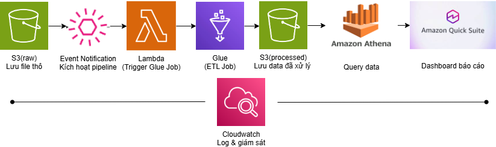

# 🚀 AWS Automated Data Pipeline (ETL + Data Lake)

## 📌 Overview

This project builds an end-to-end automated data pipeline on AWS for processing and analyzing sales data.

The system ingests raw data, performs ETL transformation using AWS Glue (PySpark), and stores optimized data in a Data Lake for querying and visualization.

## 🏗️ Architecture



**Workflow:**

1. Upload raw data to Amazon S3
2. Trigger AWS Lambda via S3 event
3. Lambda starts AWS Glue ETL job
4. Data is cleaned, transformed, and stored in Parquet format
5. Amazon Athena queries processed data
6. Dashboard built using Amazon QuickSight

---

## 🎥 Demo Video
This demo shows the automated ETL pipeline triggered by S3 events, including Lambda execution, Glue job processing, and querying results in Athena.

[▶️ Watch Demo](https://drive.google.com/file/d/1AaetpZK3k4brSbfcl-PyJ8200B8z8JF9/view)

## ⚙️ Tech Stack

* **Storage:** Amazon S3 (Data Lake)
* **Processing:** AWS Glue (PySpark)
* **Orchestration:** AWS Lambda
* **Query Engine:** Amazon Athena
* **Monitoring:** AWS CloudWatch
* **Visualization:** Amazon QuickSight

---

## 🔄 Data Pipeline

* Automated ETL triggered by S3 events
* Data cleaning and type casting
* Date parsing and feature engineering (Year, Month)
* Partitioning data by year/month
* Writing optimized Parquet files

---

## 🚀 Key Features

* Fully automated pipeline using serverless architecture
* Handles large-scale datasets (~1GB+)
* Improves query performance using:

  * Columnar storage (Parquet)
  * Partitioning (year/month)
  * Snappy compression

---


## 📊 Results

* Reduced query latency using Parquet + partitioning
* Improved storage efficiency compared to CSV
* Enabled scalable analytics using Athena

---

## 📂 Project Structure

```
aws-data-pipeline/
├── architecture/
├── etl/
├── lambda/
├── docs/
├── sample_data/
```

---

## ▶️ How to Run

1. Upload raw CSV file to S3
2. Lambda automatically triggers Glue job
3. Data is processed and stored in S3 (Parquet)
4. Query data using Athena

---

## 📎 Additional Resources

* Full report: `docs/report.pdf`
* Sample data included for testing

---
